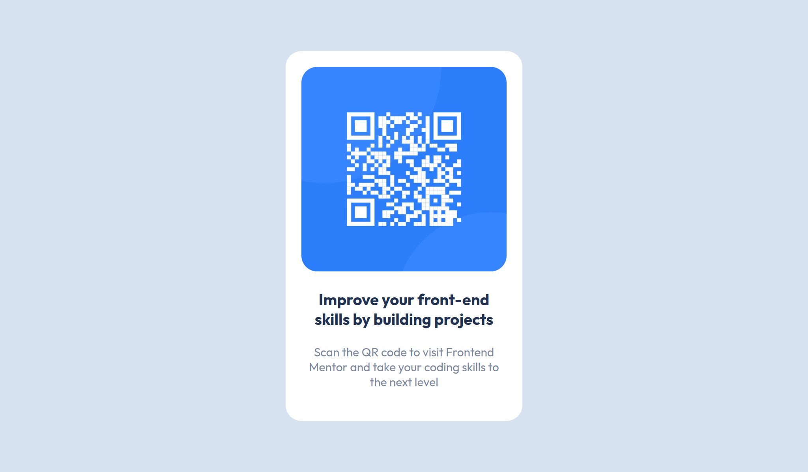

# Frontend Mentor - QR code component solution

This is a solution to the [QR code component challenge on Frontend Mentor](https://www.frontendmentor.io/challenges/qr-code-component-iux_sIO_H). Frontend Mentor challenges help you improve your coding skills by building realistic projects. 

## Table of contents

  - [Screenshot](#screenshot)
  - [Links](#links)
  - [Built with](#built-with)
- [Author](#author)

### Screenshot

### Links

- [Live Site URL](https://bytepack-frontendmentor-qrcode.pages.dev)

### Built with

- HTML5
- CSS3

## Author

- Frontend Mentor - [@bytepack](https://www.frontendmentor.io/profile/bytepack)

